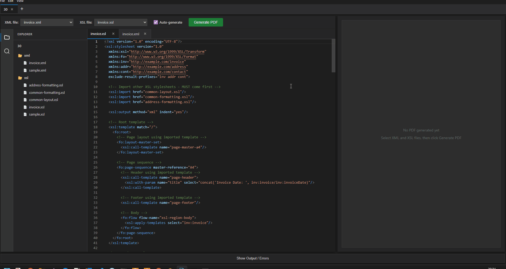

# FOP Live Editor

A desktop application for editing and previewing XSL-FO transformations in real-time. Built with Electron, React, Vite, and Apache FOP.

## Demo


## Features

- � **Workspace System** - Multi-workspace tabs with persistent settings
- 📝 **Monaco Editor** - VS Code editor with XML/XSL syntax highlighting
- 🗂️ **File Explorer** - Hierarchical folder structure with context menu operations
- 👁️ **Live PDF Preview** - Persistent FOP server for fast generation (50-80% faster)
- 🔍 **Full-text Search** - Workspace-wide search with regex support
- ⚡ **Auto-generate** - Optional debounced PDF generation on file save
- 🔄 **Auto-updates** - Built-in update notifications and installation

## Download

**[Download the latest release](https://github.com/bogdan-lefter09/fop-live-editor/releases)** - Windows x64 installer and portable ZIP available

## Prerequisites

Before running this application, you need to download and set up the bundled resources:

### 1. Java Runtime Environment (JRE)

Download Eclipse Temurin JRE 8+ for Windows x64 from [Adoptium](https://adoptium.net/):
- Choose: **JRE** (not JDK), **Windows x64**, **Version 8 or higher**
- Extract the downloaded archive
- Copy the extracted JRE folder to: `assets/bundled/jre/`
- Verify the structure: `assets/bundled/jre/bin/java.exe` should exist

### 2. Apache FOP

Download Apache FOP 2.11 binary distribution from [Apache FOP Downloads](https://xmlgraphics.apache.org/fop/download.html):
- Download the binary distribution (not source)
- Extract the downloaded archive
- Copy the contents of `fop-2.11/fop/` to: `assets/bundled/fop/`
- Verify the structure:
  - `assets/bundled/fop/build/fop-2.11.jar`
  - `assets/bundled/fop/lib/` (containing dependency JARs)

## Setup

1. **Clone the repository:**
   ```bash
   git clone <repository-url>
   cd fop-live-editor
   ```

2. **Install dependencies:**
   ```bash
   npm install
   ```

3. **Set up bundled resources** (see Prerequisites above)

4. **Run in development mode:**
   ```bash
   npm run dev
   ```

## Usage

1. **Create/Open Workspace** - Click "New PDF Workspace" or open an existing folder
2. **Edit Files** - Open files from the file explorer, edit with Monaco editor
3. **Select Main Files** - Choose XML and XSL files from toolbar dropdowns
4. **Generate PDF** - Click "Generate PDF" or enable auto-generate on save
5. **File Operations** - Right-click in explorer to create/rename/delete files and folders

## Project Structure

```
fop-live-editor/
├── assets/bundled/        # Bundled JRE + FOP (not in git)
├── examples/              # Sample XML/XSL files (copied to new workspaces)
├── src/
│   ├── main/              # Electron main process + FopServer.java
│   └── renderer/          # React UI with Monaco editor
├── release/               # Built installers (generated)
└── package.json
```

## Scripts

- `npm run dev` - Start development server with hot reload
- `npm run build` - Build for production
- `npm run package` - Package the app for Windows (creates installer)
- `npm run preview` - Preview production build

## Technology Stack

- **Electron** + **React** + **Vite** + **TypeScript**
- **Monaco Editor** - VS Code editor component
- **Persistent FOP Server** - Custom Java server for fast PDF generation
- **Eclipse Temurin JRE 8+** - Bundled Java runtime

## Building for Production

To create a distributable package:

```bash
npm run package
```

This will create an installer in the `release/` folder.

## Notes

- Bundled JRE and FOP not included in repository (download separately)
- Workspaces store settings in `.fop-editor-workspace.json`
- Windows x64 only, portable ZIP and NSIS installer available

## Testing

| Command | What it runs |
|---|---|
| `npm test` | Unit, component and integration tests (Vitest) |
| `npm run test:unit` / `test:components` / `test:integration` | A single layer |
| `npm run test:e2e` | Builds the app, then Playwright drives the real Electron app |

Tests that need a real FOP (8 integration tests and 2 E2E tests) use the bundled setup in `assets/bundled/` (see setup above) and are skipped if it is missing. Override with `FOP_DIR`, `GSON_JAR` and `FOP_JAVA_HOME`/`JAVA_HOME`. They also need a JDK with `javac` (via `JAVA_HOME` or `FOP_JAVA_HOME`) to compile `FopServer.java`; the bundled JRE has no compiler.

To run every layer with nothing skipped: `.\tests\run-all.ps1 -JavaHome <JDK dir>` (fails early if FOP, gson or a JDK is missing).

